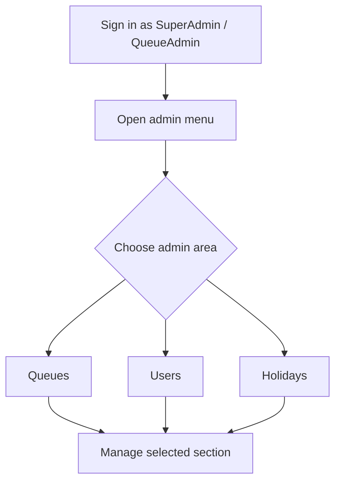
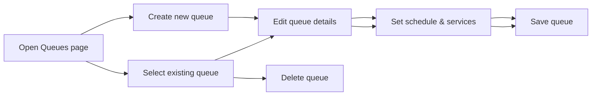

# ConfigAdmins (SuperUsers) Guide

This guide is a complete reference for ConfigAdmins and SuperUsers in FastQ. It covers how to access the admin menu, manage queues, manage users, define holidays, and use the admin dashboard.

## Table of contents

- [Introduction](#introduction)
- [Who can use this guide](#who-can-use-this-guide)
- [Accessing the admin menu](#accessing-the-admin-menu)
- [Admin Dashboard](#admin-dashboard)
- [Manage Queues](#manage-queues)
  - [Queue list view](#queue-list-view)
  - [Create or edit a queue](#create-or-edit-a-queue)
  - [Queue schedule and services](#queue-schedule-and-services)
  - [Delete a queue](#delete-a-queue)
- [Manage Users](#manage-users)
  - [User list and search](#user-list-and-search)
  - [Add or edit a user](#add-or-edit-a-user)
  - [Assign permissions by queue](#assign-permissions-by-queue)
- [Manage Holidays](#manage-holidays)
  - [Holiday list view](#holiday-list-view)
  - [Add or edit a holiday](#add-or-edit-a-holiday)
  - [Delete a holiday](#delete-a-holiday)
- [Best practices](#best-practices)
- [Troubleshooting](#troubleshooting)

## Introduction

ConfigAdmins and SuperUsers are responsible for system setup and configuration. This is not the same as the operational Provider or Host experience. ConfigAdmins maintain the structure that drives customer and provider workflows.

In FastQ, the admin areas are:

- **Queues**: define service queues, availability, and operational settings.
- **Users**: create and manage user accounts, roles, and queue permissions.
- **Holidays**: declare calendar exceptions and closed dates.
- **Dashboard**: entry point to the admin menu.

## Who can use this guide

- **SuperAdmin**: full access to Queues, Users, Holidays, and the admin menu.
- **QueueAdmin**: access to Queues and Reports, plus selected queue-level permissions.

> Note: Only SuperAdmins can manage users and holidays. QueueAdmins can manage queues for their assigned queues.

## Accessing the admin menu

1. Sign in with a ConfigAdmin or SuperUser account.
2. Open the main navigation bar on the left side of the application.
3. Under **Admin**, select one of the available links:
   - `Queues`
   - `Users` (SuperAdmin only)
   - `Holidays` (SuperAdmin only)

If you have the proper role, the admin nav appears below the general workspace links.

## Admin Dashboard

The admin dashboard is the entry point to the configuration areas. It provides a simple topbar title and quick navigation to the admin sections.

When the admin menu is open, you can quickly jump to:

- `Queues` to maintain queue definitions.
- `Users` to maintain user accounts and permissions.
- `Holidays` to manage closed or special calendar dates.

## Admin workflow and flow diagrams

The following diagrams show the ConfigAdmin flow and the queue configuration process.

### Admin access flow

### Queue configuration flow

> These flows reflect the admin menu and the standard queue management lifecycle.

## Manage Queues

The Queue page lets ConfigAdmins create, update, and remove queue definitions. Queues are the containers for service workflows, and they determine how customers and providers move through the system.

### Queue list view

The `Queues` page displays a table of active queue definitions. The columns are:

- `Id`: Queue identifier.
- `Name`: Queue display name.
- `Active`: whether the queue is active.
- `EmpOnly`: whether the queue is employee-only.
- `LeadTimeMin`: minimum lead time for appointments.
- `LeadTimeMax`: maximum lead time for appointments.

Each row includes action buttons to:

- `Edit`: update queue settings.
- `Delete`: remove the queue after confirmation.

### Create or edit a queue

To create a queue:

1. From the Queues list view, click `Create New`.
2. Fill in the queue details.
3. Save the queue.

To edit a queue:

1. Click `Edit` for the selected queue.
2. Update the queue values.
3. Click `Save`.

Important queue fields:

- **Name**: the queue label shown in the UI.
- **Active**: toggle the queue on or off.
- **EmpOnly**: use this when only employees should access the queue.
- **LeadTimeMin**: earliest appointment lead time.
- **LeadTimeMax**: latest appointment lead time.

### Queue schedule and services

Each queue contains schedule and service details, which control availability and the specific services that customers can request.

- **Schedules**: define days and hours when the queue is open.
- **Services**: list the service types available in that queue.

When editing a queue, use the embedded schedule and service editor sections to:

- Add or remove service items.
- Add or remove schedule entries.
- Adjust availability windows for each service or day.

### Delete a queue

To delete a queue:

1. Click the `Delete` button on the queue row.
2. Confirm the delete modal.

> Warning: deleting a queue removes the definition permanently. Confirm only if the queue is no longer needed.

## Manage Users

The `Users` section is for SuperAdmins only. It allows full user account management, including role and queue permission assignments.

### User list and search

The user list shows all configured users. Use the list to

- open an existing user record
- inspect user roles
- identify who has active vs disabled accounts

### Add or edit a user

To add a user:

1. Open the `Users` page.
2. Click `Create New` or `Add User`.
3. Enter the user fields:
   - `UserId`
   - `Title`
   - `First Name`
   - `Last Name`
   - `Email`
   - `Phone`
4. Set the toggles:
   - `IsActive`: permits login.
   - `Super Admin?`: grants full admin access.
   - `Spanish` / `Creole`: optional language support flags.
5. Assign queue permissions.
6. Click `Save Settings`.

To edit an existing user:

1. Open the user record from the list.
2. Update contact details or toggles.
3. Adjust permissions as needed.
4. Save the record.

### Assign permissions by queue

The user edit page includes a queue permissions table with these roles:

- `Host?`
- `Provider?`
- `Reporter?`
- `Queue Admin?`

Each queue appears in its own row. Use the checkboxes to assign the role for that queue.

There are also `select all` checkboxes in the table header to quickly assign a role across all queues.

Use these permissions to control who can access:

- host workflows
- provider workflows
- reporting features
- queue administration for a specific queue

> Note: queue permissions only apply to active queues. Inactive queues cannot receive new role assignments.

## Manage Holidays

The `Holidays` section stores calendar exceptions and market closure dates.

### Holiday list view

The holidays table includes:

- `Date`: holiday or closure date.
- `Desc`: holiday description.
- `Active`: whether the holiday is currently enforced.
- `Updated By`: last user who changed the record.
- `Updated On`: last update date.

Each row lets you edit or delete the holiday.

### Add or edit a holiday

To add a holiday:

1. Click the `Add` or `New` holiday button.
2. Enter the `Date`.
3. Add a `Description`.
4. Toggle `Active` if the date should be enforced.
5. Click `Save`.

To edit a holiday:

1. Click `Edit` next to the holiday.
2. Update the date, description, or active status.
3. Save the changes.

Holiday entries are used to temporarily close queues or apply special scheduling exceptions.

### Delete a holiday

To remove a holiday:

1. Click `Delete` on the holiday row.
2. Confirm the deletion in the modal.

> Warning: deleting a holiday permanently removes the date exception.

## Best practices

- Keep queue names clear and consistent.
- Use `Active` flags when temporarily disabling queues instead of deleting them.
- Review user roles regularly to ensure least privilege.
- Add holidays before the date to avoid schedule disruption.
- Document changes in your own change log when editing queues or access.

## Troubleshooting

- If you cannot see the `Users` or `Holidays` link, confirm you are signed in as a `SuperAdmin`.
- If queue edits are blocked, confirm you are either a `SuperAdmin` or have `Queue Admin` access for that queue.
- If a holiday does not take effect, confirm the `Active` toggle is set and the date is correct.
- If a user cannot log in, ensure `IsActive` is enabled and the account information is correct.

## Quick reference

| Area | Role required | Common actions |
| --- | --- | --- |
| Queues | SuperAdmin or QueueAdmin | Create, edit, delete, set schedules/services |
| Users | SuperAdmin | Add user, enable/disable, assign roles/perms |
| Holidays | SuperAdmin | Add date exceptions, update active status |
| Dashboard | SuperAdmin/QueueAdmin | Navigate to admin setup pages |
